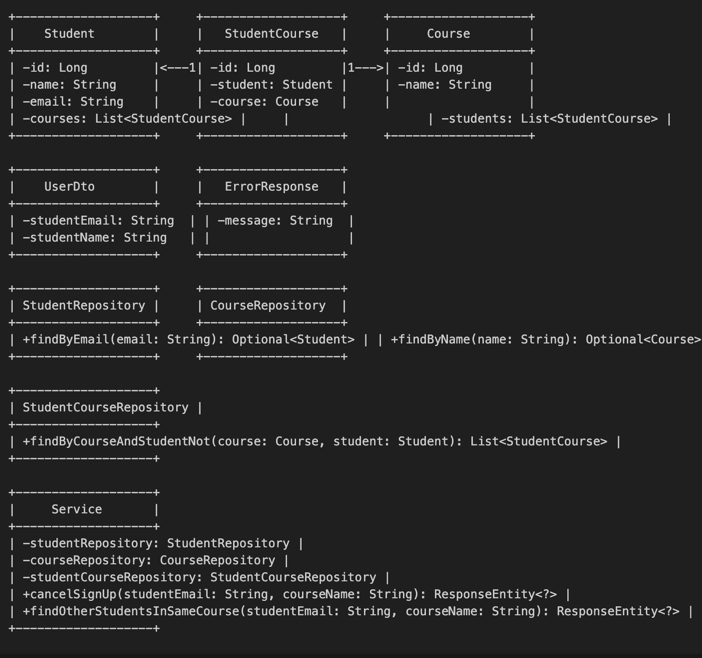

# Getting Started

### Design




### Installing Docker

Installation: [Windows](https://docs.docker.com/docker-for-windows/) xor [Mac](https://docs.docker.com/docker-for-mac/).

Java JDK 17 (If running outside docker): [JDK](https://docs.aws.amazon.com/corretto/latest/corretto-17-ug/downloads-list.html)

### Running Locally

You can run the service locally on your machine as a Java process, or inside Docker container.

### Running the Service Locally in Docker

First, create a jar file to run:

```bash
chmod +x ./gradlew
./gradlew build
```

Then start the Docker container via docker-compose:

```bash
docker compose up -d
```


Service should now be available on http://localhost:8080/ or on your docker machine's IP address port 8080 if you are using Docker Toolbox.

### Running the Service as a Java Process

You can also create a runnable jar file that contains the compiled microservice and all it’s dependencies. To create the runnable jar use the following command:

```bash
./gradlew clean build
```

You can then run the jar with the following command:

```bash
java -jar build/libs/course_management_system-0.0.1.jar

```

### Requests

Sign up for a course.
```bash
curl --location 'http://localhost:8080/api/courses/signup' \
--header 'Content-Type: application/json' \
--data-raw '{
    "studentEmail" : "aarush@yahoo.com",
    "courseName": "Coaching",
    "description": "How to test"
}'

```

Get classmates for a course.
```bash
curl --location 'http://localhost:8080/api/courses/{studentEmail}/classmates/{courseName}'

```

Get courses for a student.
```bash

curl --location 'http://localhost:8080/api/courses/{studentEmail}'

```

Cancel course sign up.
```bash

curl --location --request DELETE 'http://localhost:8080/api/courses/{studentEmail}/cancel/{courseName

```

### Configuration and Logging

This service has 3 configuration files which apply necessary configuration settings in development and production environments. Configuration settings should be replicated in these configuration files.

Which configuration file is selected depends upon the `CONFIGURATION_FILE_NAME` environment variable set in the `.github CLI` file.

The standard configuration ensures that:

* In a 'dev' environment (e.g. developer workstation, or by default) all **business event logs** and **application logs** are simply output on the console for ease of diagnostics.

## Running tests
* Run all the unit core unit tests

        ./gradlew clean test


### Application logging (standard SLF4J logging)

```yaml
logging:
  level: INFO
  appenders:
   - type: grappler
     logFormat: "%-5p [%d{ISO8601,UTC}] [%t] %c: %m%n%rEx"
     environmentName: prod
